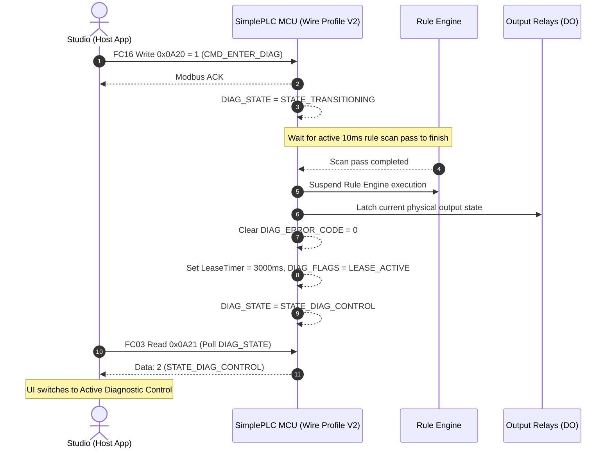
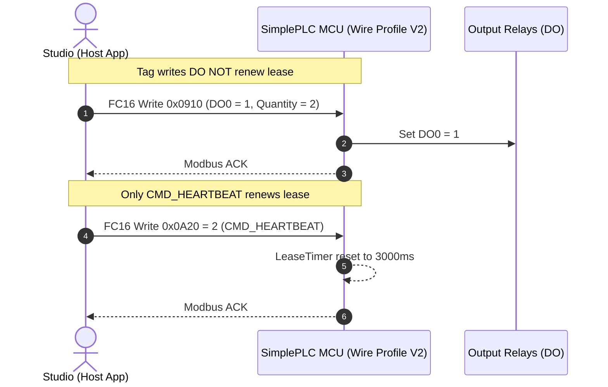
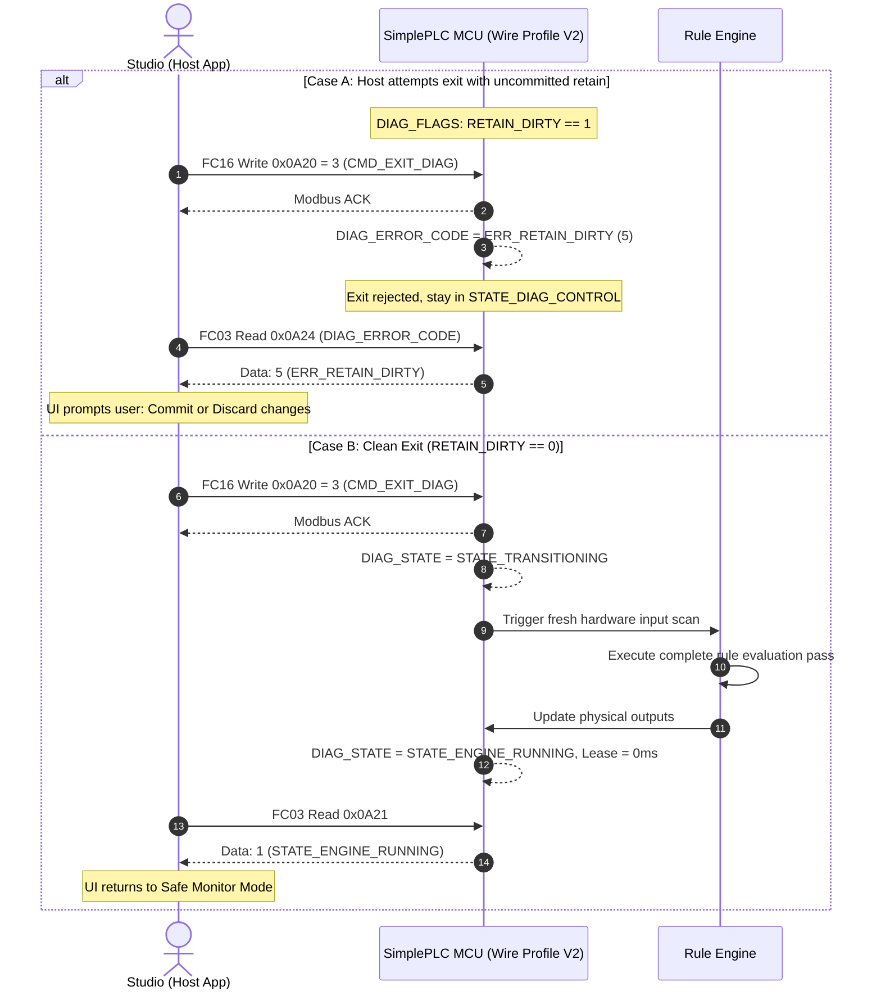
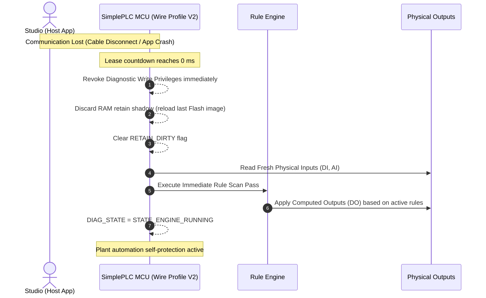

# SimplePLC Platform V2.0 — Wire Contract Draft Specification
## Diagnostic & Commissioning Control Subsystem

**Status:** REVISED DRAFT SPECIFICATION (V2.0-R2)  
**Platform Release:** SimplePLC Platform V2.0  
**Protocol Version:** 1  
**Rule Format Version:** 7 (32-byte records)  
**Wire Profile:** 2 (Diagnostic & Commissioning Superset)  
**Parent Baseline:** SimplePLC Wire Contract V1.9 (Frozen)

---

## 1. Overview & Architectural Principles

SimplePLC Platform V2.0 defines the **Diagnostic & Commissioning Control Subsystem**, extending the SimplePLC binary wire protocol to support bidirectional field testing, output overrides, live register writing, and retentive memory management.

### Key Architectural Invariants

1. **Strict Superset of Wire Profile V1**:
   - Wire Profile V2 preserves 100% of the Wire Profile V1 frozen memory map and data contract:
     - `DeviceDescriptor` at `0x0000` (10 registers)
     - `DeviceResourceInfo` at `0x0020` (10 registers)
     - `ActiveRuleTable` at `0x0100` (up to 1600 registers)
     - `DeviceHealth` at `0x0800` (10 registers)
     - `RuntimeTagValues` at `0x0900` (256 registers)
     - `SystemCommand` at `0x0A00` (1 register) and `SystemCommandResult` at `0x0A01` (2 registers)
     - `Staging & Commit Block` at `0x9000..0xA001`
   - Devices declare V2 support strictly by reporting `wire_profile = 2` at register `0x0020`. V1 devices (`wire_profile = 1`) remain frozen and continue operating in Safe Monitor (Read-Only) mode.

2. **Mutual-Exclusive Tag Store Ownership**:
   - **`ENGINE_RUNNING`**: The firmware Rule Engine maintains sole ownership of the Tag Store, executing every 10ms. Modbus writes to `0x0900..0x09FF` are strictly rejected with Modbus Exception `0x02 (ILLEGAL_DATA_ADDRESS)`.
   - **`DIAG_CONTROL`**: The Rule Engine suspends logic execution at the current scan boundary and yields Tag Store ownership to the Host Application (Studio / Commissioning Engineer). Direct runtime writes to writable tags (`DO`, `VFLAG`, `VREG`, `VREG_RETAIN`, `COUNTER`) are enabled.

3. **Lease-Based Session Lifecycle & Heartbeat Isolation**:
   - Diagnostic mode is stateful and leased:
     `1000 ms <= Lease Duration <= 60000 ms` (Default: `3000 ms`)
   - **ONLY** the explicit `CMD_HEARTBEAT` command (or `CMD_ENTER_DIAG`) resets the lease timer. Standard runtime tag writes to `0x0900` **DO NOT** renew the lease.
   - If communication is severed, the lease timer counts down to `0 ms`, triggering an automatic failsafe revocation of diagnostic control.

4. **Baseline Safe Fallback (No Hard-Coded Output Assumptions)**:
   - Upon lease expiry, the MCU does **not** assume an arbitrary state (such as `all DO = 0`, which may cause dangerous drops in active-low brake solenoids or normally-open cooling valves).
   - Baseline behavior:
     1. Revoke diagnostic write privileges immediately.
     2. Discard uncommitted RAM shadow retentive changes (reload last valid Flash retain image).
     3. Restore Tag Store ownership to the Rule Engine.
     4. Perform an immediate fresh scan of hardware inputs (`DI`, `AI`).
     5. Execute a full rule evaluation pass and apply the computed outputs to physical actuators.
     6. Transition `DIAG_STATE` back to `STATE_ENGINE_RUNNING`.

5. **Strict 32-Bit Atomic Write Contract & All-or-Nothing Rule**:
   - Each runtime tag occupies 2 Modbus registers (32-bit Big-Endian).
   - Writes to `0x0900..0x09FF` **MUST** use Modbus Function Code 16 (`FC16 - Write Multiple Registers`) with `Quantity = 2 * N` (where N is the number of tags) aligned to even base addresses (`0x0900 + TagIndex * 2`).
   - Function Code 06 (`FC06 - Write Single Register`) or odd quantity writes are strictly rejected with `0x03 (ILLEGAL_DATA_VALUE)`.
   - **All-or-Nothing Transaction**: If an FC16 request spans multiple tags and contains any read-only, reserved, or unauthorized tag index, the **entire request is rejected with `0x02`** without any partial writes.

6. **RAM-Shadowed Retentive Memory with Dirty Interlock**:
   - Writes to `VREG_RETAIN` during `DIAG_CONTROL` modify **RAM shadow memory only**. Changes assert `RETAIN_DIRTY = 1` in `DIAG_FLAGS`.
   - Attempting to exit diagnostics (`CMD_EXIT_DIAG`) while `RETAIN_DIRTY == 1` is **REJECTED** with error `ERR_RETAIN_DIRTY`. The engineer must explicitly issue `CMD_COMMIT_RETAIN` or `CMD_DISCARD_RETAIN`.
   - In case of unexpected Lease Expiry (loss of communication), uncommitted RAM changes are **AUTOMATICALLY DISCARDED** to prevent silent Flash corruption.

7. **Single Active Master Assumption & Session Roadmap**:
   - Wire Profile V2.0 assumes a dedicated point-to-point transport (USB CDC-ACM VCP or dedicated RS-232/Ethernet socket) with a **single active Modbus master**.
   - Session ownership tokens (e.g. 32-bit Host Lease Token / UUID) to guard against multi-master collision on RS-485 multi-drop topologies are intentionally reserved for a future revision (V2.1+) to keep MCU firmware footprint and cycle overhead minimal.

---

## 2. Platform Constants

| Identifier | Value | Description |
|---|---|---|
| `SPLC_WIRE_PROFILE_V2` | `2` | Wire Profile V2 identifier (`0x0020 [0]`) |
| `SPLC_ADDR_DIAG_BLOCK` | `0x0A20` | Base address of Diagnostic Control Block |
| `SPLC_LEN_DIAG_BLOCK` | `5` | Length of Diagnostic Control Block (5 registers) |
| `SPLC_MIN_DIAG_LEASE_MS` | `1000` | Minimum allowable lease duration |
| `SPLC_DEFAULT_DIAG_LEASE_MS` | `3000` | Default lease duration in milliseconds |
| `SPLC_MAX_DIAG_LEASE_MS` | `60000` | Maximum allowable lease duration (fits in uint16) |
| `SPLC_TARGET_HEARTBEAT_MS` | `1000` | Recommended host heartbeat transmission period |

---

## 3. Diagnostic Control Block Register Map (`0x0A20..0x0A24`)

| Address | Register Name | Access | Data Type | Function & Description |
|---|---|:---:|:---:|---|
| **`0x0A20`** | `DIAG_COMMAND` | **WO** | `uint16` | **Command Mailbox (Action Trigger)**:<br>• `1` = `CMD_ENTER_DIAG`: Request manual ownership<br>• `2` = `CMD_HEARTBEAT`: Renew active lease<br>• `3` = `CMD_EXIT_DIAG`: Restore logic execution<br>• `4` = `CMD_COMMIT_RETAIN`: Flush RAM shadow to Flash<br>• `5` = `CMD_DISCARD_RETAIN`: Reload RAM shadow from Flash |
| **`0x0A21`** | `DIAG_STATE` | **RO** | `uint16` | **Observable Subsystem State**:<br>• `1` = `STATE_ENGINE_RUNNING`<br>• `2` = `STATE_DIAG_CONTROL`<br>• `3` = `STATE_TRANSITIONING`<br>• `4` = `STATE_FAULT` |
| **`0x0A22`** | `DIAG_FLAGS` | **RO** | `uint16` | **Status Flags (Bitmask)**:<br>• `Bit 0` (`0x0001`): `RETAIN_DIRTY` (1 = RAM shadow differs from Flash)<br>• `Bit 1` (`0x0002`): `LEASE_ACTIVE` (1 = Lease countdown active)<br>• `Bit 2..15`: Reserved (Must be 0) |
| **`0x0A23`** | `DIAG_LEASE_REMAINING_MS`| **RO** | `uint16` | **Remaining Lease Time** in ms (counts down from lease duration to 0). |
| **`0x0A24`** | `DIAG_ERROR_CODE` | **RO** | `uint16` | **Latching Diagnostic Error Code**:<br>• `0` = `ERR_NONE`<br>• `1` = `ERR_DENIED_FAULT`<br>• `2` = `ERR_LEASE_EXPIRED`<br>• `3` = `ERR_FLASH_CRC_MISMATCH`<br>• `4` = `ERR_INVALID_COMMAND`<br>• `5` = `ERR_RETAIN_DIRTY` (Exit rejected: unsaved retain data) |

---

## 4. Enumerations & Value Freezes

### 4.1 Diagnostic Commands (`DIAG_COMMAND`, `0x0A20`)

```c
typedef enum {
    SPLC_DIAG_CMD_NONE                = 0,
    SPLC_DIAG_CMD_ENTER_DIAG          = 1, /* Acquire manual diagnostic ownership */
    SPLC_DIAG_CMD_HEARTBEAT           = 2, /* Reset lease timer to default duration */
    SPLC_DIAG_CMD_EXIT_DIAG           = 3, /* Release diagnostic ownership, resume Rule Engine */
    SPLC_DIAG_CMD_COMMIT_RETAIN       = 4, /* Atomic flush of RAM shadow to Flash */
    SPLC_DIAG_CMD_DISCARD_RETAIN      = 5  /* Reload RAM shadow from Flash, clear dirty flag */
} SPLC_DiagCommand_t;
```

> [!NOTE] `CMD_DISCARD_RETAIN` Semantics
> `CMD_DISCARD_RETAIN` is valid **ONLY** when `DIAG_STATE == STATE_DIAG_CONTROL`.
> Upon execution:
> 1. Firmware reloads `s_vreg_retain_shadow[]` from active Flash sector.
> 2. `RETAIN_DIRTY` bit in `DIAG_FLAGS` is cleared to `0`.
> 3. If `DIAG_ERROR_CODE == ERR_RETAIN_DIRTY`, it is cleared to `ERR_NONE`.
> If issued during `STATE_ENGINE_RUNNING`, the command is rejected with `DIAG_ERROR_CODE = ERR_INVALID_COMMAND`.

> [!NOTE] `CMD_COMMIT_RETAIN` Semantics
> `CMD_COMMIT_RETAIN` is valid **ONLY** when `DIAG_STATE == STATE_DIAG_CONTROL`.
> Upon execution:
> • If `RETAIN_DIRTY == 0`: **No-Op Success** (Returns `ERR_NONE`, Flash write is safely bypassed to preserve Flash endurance).
> • If `RETAIN_DIRTY == 1`: Firmware writes `s_vreg_retain_shadow[]` to the alternate Flash ping-pong sector, verifies CRC, atomically updates the active generation counter, and clears `RETAIN_DIRTY` to `0`.
> If issued during `STATE_ENGINE_RUNNING`, the command is rejected with `DIAG_ERROR_CODE = ERR_INVALID_COMMAND`.

### 4.2 Diagnostic States (`DIAG_STATE`, `0x0A21`)

```c
typedef enum {
    SPLC_DIAG_STATE_NONE              = 0,
    SPLC_DIAG_STATE_ENGINE_RUNNING    = 1, /* Normal automatic mode: Rule Engine active */
    SPLC_DIAG_STATE_DIAG_CONTROL      = 2, /* Manual diagnostic mode: Host writes permitted */
    SPLC_DIAG_STATE_TRANSITIONING     = 3, /* Scan-boundary synchronization in progress */
    SPLC_DIAG_STATE_FAULT             = 4  /* Software / Subsystem fault: Diag locked */
} SPLC_DiagState_t;
```

### 4.3 Diagnostic Flags (`DIAG_FLAGS`, `0x0A22`)

```c
typedef enum {
    SPLC_DIAG_FLAG_RETAIN_DIRTY       = (1 << 0), /* 0x0001: RAM retain values unsaved to Flash */
    SPLC_DIAG_FLAG_LEASE_ACTIVE       = (1 << 1)  /* 0x0002: Lease countdown active */
} SPLC_DiagFlags_t;
```

### 4.4 Diagnostic Error Codes (`DIAG_ERROR_CODE`, `0x0A24`)

```c
typedef enum {
    SPLC_DIAG_ERR_NONE                = 0,
    SPLC_DIAG_ERR_DENIED_FAULT        = 1, /* Rejected: System in Fault state */
    SPLC_DIAG_ERR_LEASE_EXPIRED       = 2, /* Heartbeat or write arrived after lease expiry */
    SPLC_DIAG_ERR_FLASH_CRC_MISMATCH  = 3, /* Flash commit verification failed */
    SPLC_DIAG_ERR_INVALID_COMMAND     = 4, /* Unrecognized command identifier */
    SPLC_DIAG_ERR_RETAIN_DIRTY        = 5  /* Exit rejected: uncommitted retain data in RAM */
} SPLC_DiagErrorCode_t;
```

### 4.5 `DIAG_ERROR_CODE` Lifecycle & Latching Rules

`DIAG_ERROR_CODE` is a **latching status register** with strictly defined lifecycle triggers:
1. **Latching Last Failure**: During an active diagnostic session, any command or operational rejection overwrites `DIAG_ERROR_CODE` with the most recent error identifier.
2. **Clear on Successful `CMD_ENTER_DIAG`**: When a session is successfully established, `DIAG_ERROR_CODE` is automatically reset to `ERR_NONE (0)`.
3. **Clear on Successful `CMD_DISCARD_RETAIN`**: If `DIAG_ERROR_CODE` currently holds `ERR_RETAIN_DIRTY`, executing `CMD_DISCARD_RETAIN` successfully resets the error code to `ERR_NONE (0)`.
4. **Preserved on Failsafe Expiry**: When lease expires without orderly exit, firmware latches `ERR_LEASE_EXPIRED (2)`. This ensures that when a host reconnects, it can read `0x0A24` and immediately identify why diagnostic control was revoked.
5. **Reboot Initialization**: System power-on or warm reset always initializes `DIAG_ERROR_CODE` to `ERR_NONE (0)`.

### 4.6 `DIAG_COMMAND` Function Codes & Transport Rules

To maintain maximum compatibility with industrial Modbus masters:
* **`FC06 (Write Single Register)` to `0x0A20`**: ✅ **Accepted**.
* **`FC16 (Write Multiple Registers)` to `0x0A20` with `Quantity = 1`**: ✅ **Accepted**.
* **`FC16` with `Quantity > 1`**: ❌ **Rejected** with Modbus Exception `0x03 (ILLEGAL_DATA_VALUE)` (Command register is strictly a single 16-bit word).

### 4.7 Command Idempotency & State Transition Matrix

The table below governs firmware behavior when commands arrive under various subsystem states:

| Command (`0x0A20`) | Current `DIAG_STATE` | Current `RETAIN_DIRTY` | Firmware Action & State Transition | `DIAG_ERROR_CODE` Result |
|---|---|:---:|---|---|
| **`CMD_ENTER_DIAG`** | `ENGINE_RUNNING` | - | Initiate transition to `DIAG_CONTROL` at scan boundary; init lease to 3000ms. | Reset to `ERR_NONE` |
| **`CMD_ENTER_DIAG`** | `DIAG_CONTROL` | - | **Idempotent No-Op** (Remain in `DIAG_CONTROL`; lease timer is **NOT** reset to preserve heartbeat isolation). | Unchanged |
| **`CMD_ENTER_DIAG`** | `TRANSITIONING` | - | Wait/Ignore or No-Op. | Unchanged |
| **`CMD_ENTER_DIAG`** | `FAULT` | - | Reject command. | `ERR_DENIED_FAULT` |
| **`CMD_HEARTBEAT`** | `DIAG_CONTROL` | - | Reset lease countdown timer to default duration (3000ms). | `ERR_NONE` |
| **`CMD_HEARTBEAT`** | `ENGINE_RUNNING` | - | Reject command (Heartbeat invalid outside active session). | `ERR_INVALID_COMMAND` |
| **`CMD_EXIT_DIAG`** | `DIAG_CONTROL` | `0` (Clean) | Transition to `STATE_ENGINE_RUNNING` at scan boundary; resume rule logic scan. | `ERR_NONE` |
| **`CMD_EXIT_DIAG`** | `DIAG_CONTROL` | `1` (Dirty) | **Reject exit**. Maintain `STATE_DIAG_CONTROL`. | Latch `ERR_RETAIN_DIRTY` |
| **`CMD_EXIT_DIAG`** | `ENGINE_RUNNING` | - | **Idempotent No-Op** (Already in automatic mode). | `ERR_NONE` |
| **`CMD_COMMIT_RETAIN`**| `DIAG_CONTROL` | `1` (Dirty) | Atomic write to alternate Flash ping-pong sector; clear `RETAIN_DIRTY = 0`. | `ERR_NONE` (or `ERR_FLASH_CRC_MISMATCH`) |
| **`CMD_COMMIT_RETAIN`**| `DIAG_CONTROL` | `0` (Clean) | **No-Op Success** (Skip Flash write to save cycle life). | `ERR_NONE` |
| **`CMD_COMMIT_RETAIN`**| `ENGINE_RUNNING` | - | Reject command (Flash commit forbidden in automatic mode). | `ERR_INVALID_COMMAND` |
| **`CMD_DISCARD_RETAIN`**| `DIAG_CONTROL` | - | Reload RAM shadow from Flash; clear `RETAIN_DIRTY = 0`. | Clear `ERR_RETAIN_DIRTY` to `ERR_NONE` |
| **`CMD_DISCARD_RETAIN`**| `ENGINE_RUNNING` | - | Reject command. | `ERR_INVALID_COMMAND` |


---

## 5. Runtime Tag Write Permissions & Modbus Exceptions (`0x0900..0x09FF`)

Writes are strictly regulated according to active ownership:

| Tag Group | TagIndex Range | Modbus Address | State: `ENGINE_RUNNING` | State: `DIAG_CONTROL` | Target Hardware / Storage |
|---|---|---|:---:|:---:|---|
| **`DI`** | `0..7` | `0x0900..0x090F` | ❌ Denied (`0x02`) | ❌ Denied (`0x02`) | Physical Inputs (Optocouplers) |
| **`DO`** | `8..15` | `0x0910..0x091F` | ❌ Denied (`0x02`) | ✅ **Writable** (`FC16`) | Physical Relays / Transistors |
| **`AI`** | `16..19` | `0x0920..0x0927` | ❌ Denied (`0x02`) | ❌ Denied (`0x02`) | Analog Inputs (ADC Channels) |
| **`VFLAG`** | `20..51` | `0x0928..0x0967` | ❌ Denied (`0x02`) | ✅ **Writable** (`FC16`) | Internal Memory Bits (RAM) |
| **`VREG`** | `52..83` | `0x0968..0x09A7` | ❌ Denied (`0x02`) | ✅ **Writable** (`FC16`) | Math & Timing Registers (RAM) |
| **`VREG_RETAIN`**| `84..115`| `0x09A8..0x09E7` | ❌ Denied (`0x02`) | ✅ **Writable** (`FC16`) | Retentive Shadow Buffer (**RAM Only**) |
| **`COUNTER`** | `116..123`| `0x09E8..0x09F7` | ❌ Denied (`0x02`) | ✅ **Writable** (`FC16`) | High-Speed Counter Registers (RAM) |
| **`RESERVED`**| `124..127`| `0x09F8..0x09FF` | ❌ Denied (`0x02`) | ❌ Denied (`0x02`) | Reserved Platform Slots (Read=0, Write=0x02) |

### 5.1 Address & Tag Validation Rules (Fixed Tag Space & Sparse Layout)

SimplePLC maps all tags to **fixed TagIndex locations** regardless of how many tags are physically present on a given hardware variant:

```text
TagIndex = (Modbus Register Address - 0x0900) / 2
```

To support sparse configurations (e.g., Zigbee hardware declaring only 2 DI and 2 DO), the firmware validates each tag against its **declared group capacity**, rather than treating `runtime_tag_count` as a contiguous ceiling.

> [!CAUTION] Critical Validation Invariant: DO NOT use `TagIndex < runtime_tag_count`
> `runtime_tag_count` is the total count of valid declared tags across all groups, NOT a continuous index boundary.
> For example: On a device with `DI = 2, DO = 2`, `runtime_tag_count = 4`. But `DO0` is at `TagIndex 8`. Checking `8 < 4` would falsely reject valid `DO0` operations!

#### Per-Tag Validation Algorithm:
1. Compute `TagIndex = (Address - 0x0900) / 2`.
2. Classify group and check relative index against `DeviceResourceInfo`:
   * **`DI` (`TagIndex 0..7`)**: Physical Input → **Always Denied (`0x02`)** (Read-Only).
   * **`DO` (`TagIndex 8..15`)**: `rel = TagIndex - 8`. Valid if `rel < do_count`. If `rel >= do_count` → **Denied (`0x02`)**.
   * **`AI` (`TagIndex 16..19`)**: Analog Input → **Always Denied (`0x02`)** (Read-Only).
   * **`VFLAG` (`TagIndex 20..51`)**: `rel = TagIndex - 20`. Valid if `rel < vflag_count`. If `rel >= vflag_count` → **Denied (`0x02`)**.
   * **`VREG` (`TagIndex 52..83`)**: `rel = TagIndex - 52`. Valid if `rel < vreg_count`. If `rel >= vreg_count` → **Denied (`0x02`)**.
   * **`VREG_RETAIN` (`TagIndex 84..115`)**: `rel = TagIndex - 84`. Valid if `rel < vreg_retain_count`. If `rel >= vreg_retain_count` → **Denied (`0x02`)**.
   * **`COUNTER` (`TagIndex 116..123`)**: `rel = TagIndex - 116`. Valid if `rel < counter_count`. If `rel >= counter_count` → **Denied (`0x02`)**.
   * **`RESERVED` (`TagIndex 124..127`)**: Platform Reserved → **Always Denied (`0x02`)**.
   * **Out of Space (`TagIndex >= 128` or `Address > 0x09FF`)**: → **Always Denied (`0x02`)**.

---

### 5.2 Multi-Tag Write Validation & Cross-Boundary All-or-Nothing Rule

When a Modbus client issues an FC16 write containing multiple tags (`Quantity = 2 * N`), firmware **MUST** implement a **Two-Phase Pre-Flight Transaction**:

1. **Phase 1: Pre-Flight Inspection**:
   * Verify `DIAG_STATE == STATE_DIAG_CONTROL`.
   * Verify base address is even: `(Address - 0x0900) % 2 == 0`.
   * Verify quantity is even: `Quantity % 2 == 0`.
   * Iterate over all `N` tags in the span `[ start_tag .. start_tag + N - 1 ]`:
     - If **ANY** tag in this span fails the Per-Tag Validation (read-only, out-of-range, or reserved), **abort the entire transaction immediately** and respond with Modbus Exception `0x02 (ILLEGAL_DATA_ADDRESS)`.
2. **Phase 2: Atomic RAM Commit**:
   * If and only if all `N` tags pass Phase 1, commit the values into their respective RAM buffers (`s_tags[]` and/or `s_vreg_retain_shadow[]`).
   * If any tag in the span is `VREG_RETAIN`, assert `RETAIN_DIRTY = 1`.

#### Concrete Cross-Boundary Examples:

* **Example 1: DO Boundary Crossing into AI (Read-Only Collision)**:
  - Write starts at `DO7` (`TagIndex 15`, `0x091E`) with `Quantity = 4` (2 tags: `DO7` and `AI0`).
  - `DO7` is writable, but `AI0` (`TagIndex 16`) is Read-Only.
  - → **Result**: Reject entire frame with `0x02`. `DO7` is **NOT** modified.
* **Example 2: Sparse Hardware Capacity Violation**:
  - Device declares `do_count = 2` (only `DO0` and `DO1` exist).
  - Client writes starting at `DO1` (`TagIndex 9`, `0x0912`) with `Quantity = 4` (tags `DO1` and `DO2`).
  - `DO2` has relative index `2 >= do_count`.
  - → **Result**: Reject entire frame with `0x02`. `DO1` is **NOT** modified.
* **Example 3: Boundary Crossing into Reserved Range**:
  - Write starts at `COUNTER7` (`TagIndex 123`, `0x09F6`) with `Quantity = 4` (tags `COUNTER7` and `RESERVED124`).
  - Tag 124 is reserved.
  - → **Result**: Reject entire frame with `0x02`. `COUNTER7` is **NOT** modified.

---

### 5.3 Modbus Exception Code Summary

* **`0x02 (ILLEGAL_DATA_ADDRESS)`**:
  - Write attempted when `DIAG_STATE != STATE_DIAG_CONTROL`.
  - Write attempted on read-only tags (`DI`, `AI`).
  - Write attempted on unpopulated tags (`rel >= declared_count`).
  - Write attempted on reserved tags (`124..127`) or out of memory bounds (`TagIndex >= 128`).
  - Any tag in an FC16 multi-tag span violates the above criteria (All-or-Nothing).
* **`0x03 (ILLEGAL_DATA_VALUE)`**:
  - Single-register FC06 used on `0x0900..0x09FF` (only FC16 is permitted).
  - FC16 `Quantity` is odd (`Quantity % 2 != 0`).
  - Base address is not aligned to a tag boundary (`(Address - 0x0900) % 2 != 0`).

---

### 5.4 Unpopulated Slot Semantics (Read, Write, and UI Representation)

For any slot in the 128-tag memory space (`0x0900..0x09FF`) that exceeds the declared count of its group (e.g. `DO2..DO7` when `do_count = 2`):
1. **Modbus FC03 Read**: Firmware returns raw 32-bit zero (`0x0000 0000`). It **MUST NOT** generate Modbus exceptions for reading within `0x0900..0x09FF`.
2. **Modbus FC16 Write**: Firmware strictly returns Modbus Exception `0x02 (ILLEGAL_DATA_ADDRESS)`.
3. **Studio Host & UI Representation**:
   - The host application marks the slot as `Unpopulated / Inactive`.
   - Unpopulated slots are filtered out of the Tag Catalog, Live Watch list, and Rule Designer binding dropdowns.
   - They **MUST NEVER** be displayed to the user as active or operable tags.

---

## 6. Communication Sequence & Protocol Handshake

> [!IMPORTANT] Protocol Semantics: Modbus Transport ACK vs Command Execution Status
> A standard Modbus FC16 response (**ACK**) confirms only that the Modbus request frame was valid, received without parity/CRC errors, and successfully placed into the command mailbox register (`0x0A20`).
> **It DOES NOT mean the command has completed or succeeded.**
> The host software **MUST** read `DIAG_STATE` (`0x0A21`) and `DIAG_ERROR_CODE` (`0x0A24`) to observe actual command execution outcomes:
> • For `CMD_ENTER_DIAG`: Wait/poll until `DIAG_STATE == STATE_DIAG_CONTROL`.
> • For `CMD_EXIT_DIAG`: Wait/poll until `DIAG_STATE == STATE_ENGINE_RUNNING` (or detect reject via `DIAG_ERROR_CODE == ERR_RETAIN_DIRTY`).
> • For `CMD_COMMIT_RETAIN`: Wait/poll until `RETAIN_DIRTY == 0` (or detect failure via `DIAG_ERROR_CODE == ERR_FLASH_CRC_MISMATCH`).

### 6.1 Diagnostic Mode Entry (Scan Boundary Synchronization)



### 6.2 Commissioning & Heartbeat Isolation



### 6.3 Normal Session Exit with Dirty Retain Protection



### 6.4 Failsafe Lease Expiry (Loss of Communication)



---

### 6.5 Host Asynchronous State Transition Timeout Policies

Because command execution occurs asynchronously across scan boundaries or involves Flash page programming, the Host application (Studio) enforces explicit timeout bounds when polling `DIAG_STATE` and `DIAG_FLAGS`:

| Operation | Target Condition | Max Host Timeout | Action on Expiry |
|---|---|:---:|---|
| **`CMD_ENTER_DIAG`** | `DIAG_STATE == STATE_DIAG_CONTROL` | **1000 ms** | Flag transition timeout; notify user that PLC scan loop or hardware fault prevented entering diagnostics. |
| **`CMD_EXIT_DIAG`** | `DIAG_STATE == STATE_ENGINE_RUNNING` | **1000 ms** | If `DIAG_ERROR_CODE == ERR_RETAIN_DIRTY`, prompt user to Commit or Discard; otherwise flag exit timeout. |
| **`CMD_COMMIT_RETAIN`**| `RETAIN_DIRTY == 0` | **2000 ms** | If `DIAG_ERROR_CODE == ERR_FLASH_CRC_MISMATCH`, alert CRC verification failure; otherwise flag Flash write timeout. |

These bounded timeouts ensure the Studio UI never locks up or hangs indefinitely in `STATE_TRANSITIONING`.

---

## 7. Retentive Memory Commit Protocol

1. **Runtime Isolation**:
   - `FC16` writes to `0x09A8..0x09E7` update the in-memory array `s_vreg_retain_shadow[]`.
   - The MCU asserts `RETAIN_DIRTY` (`DIAG_FLAGS` bit 0).
2. **Commit Execution (`CMD_COMMIT_RETAIN`)**:
   - Upon receiving `CMD_COMMIT_RETAIN` (`0x0A20 = 4`):
     1. Calculate CRC-16 of `s_vreg_retain_shadow[]`.
     2. Write payload + CRC-16 to the alternate Flash sector (Ping-Pong Sector A/B).
     3. Verify Flash sector CRC-16 against calculated CRC-16.
     4. Update active sector metadata pointer atomically.
     5. Clear `RETAIN_DIRTY` flag (`0x0A22 [0] = 0`).
     6. If verification fails, leave `RETAIN_DIRTY` asserted and set `DIAG_ERROR_CODE = ERR_FLASH_CRC_MISMATCH`.
3. **Discard Execution (`CMD_DISCARD_RETAIN`)**:
   - Upon receiving `CMD_DISCARD_RETAIN` (`0x0A20 = 5`):
     1. Copy active Flash image back into `s_vreg_retain_shadow[]`.
     2. Clear `RETAIN_DIRTY` flag (`0x0A22 [0] = 0`).

---

## 8. Host Application Compatibility & Capability Derivation

Studio clients inspect `session.Product.WireProfile`:

```text
session.Product.WireProfile
    │
    ├── 1 (V1.9 Baseline) ──► SupportsDiagnosticControl = false
    │                         SupportsRuntimeWrite       = false
    │                         UI: "🔒 Safe Monitor Mode (Read-Only)"
    │
    └── 2 (V2.0 Superset) ──► SupportsDiagnosticControl = true
                              SupportsRuntimeWrite       = true
                              SupportsRetainCommit       = true
                              UI: "⚡ Diagnostics & Commissioning Available"
```

No heuristic guessing or unallocated register overloading is required; capabilities are derived deterministically from the standardized wire profile identifier.

---

### 8.1 Host Codebase Implementation Roadmap (SimplePLC C# Architecture)

To bridge this specification into the clean architecture codebase, the following layers will be updated during the implementation phase:

1. **Protocol Layer (`SimplePLC.Protocol`)**:
   * Add constants `SPLC_WIRE_PROFILE_V2 = 2`, `SPLC_ADDR_DIAG_BLOCK = 0x0A20`, command/state/error enums.
   * Add `DiagnosticControlBlockDto` (5 registers) with codec for FC03/FC16.
   * Add `WriteRuntimeTagsRequest` enforcing even quantity and 32-bit tag alignment.
2. **Domain Layer (`SimplePLC.Domain`)**:
   * Add `WireProfile` property to `ProductDefinition`.
   * Add capability helpers: `SupportsDiagnosticControl`, `SupportsRuntimeWrite`, `SupportsRetainCommit`.
3. **Application Layer (`SimplePLC.Application`)**:
   * Update `DeviceProfileBuilder` to accept both `WireProfile == 1` and `WireProfile == 2`.
   * Introduce `IDiagnosticControlService`:
     - Leased heartbeat background worker (1000ms period).
     - State machine manager: `EnterDiagnosticModeAsync`, `ExitDiagnosticModeAsync`.
     - Retentive memory coordinator: `CommitRetainAsync`, `DiscardRetainAsync`.
     - Atomic tag writer with sparse hardware validation pre-checks.
4. **Hardware Simulator & Mock (`SimplePLC.McuEmulator` / `SimulatorRegisterMemory`)**:
   * Implement `0x0A20..0x0A24` register block behavior.
   * Simulate Rule Engine ownership suspension and resume at scan boundaries.
   * Simulate lease countdown timer and failsafe fallback.
   * Simulate RAM shadow array and dirty flag for `VREG_RETAIN`.
5. **Presentation Layer (`SimplePLC.Studio`)**:
   * Update `LiveWatchViewModel` / `MainViewModel`:
     - Show Mode toggle: Safe Monitor vs Diagnostic Commissioning.
     - Live Lease Countdown indicator & Connection Heartbeat badge.
     - Retain dirty warning bar with explicit "Commit to Flash" and "Discard Changes" buttons.
     - Interactive overrides for `DO`, `VFLAG`, `VREG`, `COUNTER`.
6. **Verification Suites (`tests/`)**:
   * Unit tests for sparse tag validation (rejecting out-of-range tags, DI/AI writes, odd quantities).
   * Integration tests verifying lease expiry fallback and retain shadow commit/discard.

---

### 8.2 Host-Side Sparse Tag Reading Architecture

In SimplePLC, `ProductDefinition.Tags` is a sparse collection with non-contiguous `TagIndex` values (e.g. `TagIndex 0, 1` for DI, `TagIndex 8, 9` for DO).
Therefore, the host software **MUST NOT** perform:

```csharp
// ANTI-PATTERN: Fails on sparse hardware layouts!
var values = await ReadRuntimeTagValuesAsync(count: product.Tags.Count); // Assuming indices 0..count-1
```

#### Standard Reading Strategies:
1. **Strategy A: Chunked Full Memory Space Read (Standard Studio Monitor Service)**:
   - Read the active tag memory space (`0x0900` up to `0x0900 + (HighestTagIndex + 1) * 2`).
   - For standard 124-tag systems, this spans up to `0x09F7` (248 registers), partitioned into 2 standard Modbus FC03 requests (e.g., 124 registers each).
   - Maps each 32-bit register pair directly to its fixed `TagIndex = (RegisterAddress - 0x0900) / 2`.
   - Yields `RuntimeTagValue(int TagIndex, int RawValue)`.
2. **Strategy B: Per-Group Block Read (Low-Bandwidth Option)**:
   - Issues discrete FC03 reads per populated group (e.g. 1 read for DI `0x0900`, 1 read for DO `0x0910`).
   - Ideal for low-baudrate RS-485 connections where only declared channels are polled.

#### Output Contract:
Regardless of the reading strategy chosen, the protocol/application API layer **MUST** return `IReadOnlyList<RuntimeTagValue>` where every item encapsulates its explicit `TagIndex`, completely eliminating array index misalignments.

---

## 9. Dedicated Function Block Subsystem (Timer & Counter Register Map `0x0B00..0x0B7F`)

Wire Profile V2 defines the **Dedicated Function Block Subsystem**, dedicating high-speed Modbus Holding Register space for hardware-timed and event-driven Function Blocks (FB).

### 9.1 Key Architectural Principles

1. **Power-of-2 Fixed Alignment (8 Registers / 16 Bytes per Block)**:
   - Each Timer and Counter block is allocated exactly 8 contiguous 16-bit registers (16 bytes).
   - Addressing for block index `i` in `[0..7]` is calculated strictly via bit shift without CPU division:
     - `Address_Timer[i] = 0x0B00 + (i << 3)`
     - `Address_Counter[i] = 0x0B40 + (i << 3)`
2. **Flash Wear Protection & RAM Runtime Execution**:
   - Accumulators (`ET` for Timers, `CV` for Counters) execute strictly in **Volatile RAM** at scan rate (10ms) or hardware interrupt rate (1ms/GPIO edge).
   - Sensor pulse counting (`CV++`, `CV--`) **NEVER** performs direct Flash sector erase/programming.
   - Retentive persistence across power cycles is delegated to the existing Flash Ping-Pong Subsystem (Appendix A) via `RETAIN_TAG_INDEX`:
     - If `RETAIN_TAG_INDEX != 0xFFFF`, firmware synchronizes `CV` with `s_vreg_retain_shadow[RETAIN_TAG_INDEX]` and asserts `RETAIN_DIRTY = 1`.
     - If `RETAIN_TAG_INDEX == 0xFFFF`, the counter is volatile/ephemeral (zero Flash consumption).
3. **Single-Roundtrip Diag Live Telemetry**:
   - Host monitors live canvas states via a single Modbus `FC03` read spanning `0x0B00` with length 64 (8 Timers) or 128 (8 Timers + 8 Counters). Roundtrip latency over USB VCP is <= 20 ms.

---

### 9.2 Timer Block Register Map (`0x0B00..0x0B3F`, 8 Timers: `T0..T7`)

| Offset | Register Name | Access | Data Type | Function & Description |
|:---:|---|:---:|:---:|---|
| **`+0`** | `STATUS_BITS` | **RO** | `uint16` | **Instantaneous Status Bitmask**:<br>• `Bit 0` (`0x0001`): `IN` (Input trigger is energized)<br>• `Bit 1` (`0x0002`): `Q` (Output energized: elapsed time reached)<br>• `Bit 2` (`0x0004`): `RESET` (Hardware reset line energized)<br>• `Bit 3` (`0x0008`): `RUNNING` (Timer actively timing: `IN == 1 && ET < PT`)<br>• `Bit 4..15`: Reserved (Must be 0) |
| **`+1`** | `MODE` | **R/W** | `uint16` | **Timer Operating Mode**:<br>• `0` = `DISABLED`<br>• `1` = `TON` (Timer On-Delay)<br>• `2` = `TOF` (Timer Off-Delay)<br>• `3` = `TP` (Timer Pulse) |
| **`+2..3`**| `PT` | **R/W** | `uint32` | **Preset Time (ms)**: 32-bit Big-Endian (High Word at `+2`, Low Word at `+3`). |
| **`+4..5`**| `ET` | **RO** | `uint32` | **Elapsed Time (ms)**: 32-bit Big-Endian (Real-time timing accumulator). |
| **`+6..7`**| `RESERVED` | **RO** | 2 regs | Reserved for future expansion (0x0000). |

---

### 9.3 Counter Block Register Map (`0x0B40..0x0B7F`, 8 Counters: `C0..C7`)

| Offset | Register Name | Access | Data Type | Function & Description |
|:---:|---|:---:|:---:|---|
| **`+0`** | `STATUS_BITS` | **RO** | `uint16` | **Instantaneous Status Bitmask**:<br>• `Bit 0` (`0x0001`): `CU` (Count-up input line is energized)<br>• `Bit 1` (`0x0002`): `CD` (Count-down input line is energized)<br>• `Bit 2` (`0x0004`): `R` (Reset line is energized)<br>• `Bit 3` (`0x0008`): `Q` (Done output: `CV >= PV` for CTU, `CV <= 0` for CTD)<br>• `Bit 4..15`: Reserved (Must be 0) |
| **`+1`** | `MODE` | **R/W** | `uint16` | **Counter Operating Mode**:<br>• `0` = `DISABLED`<br>• `1` = `CTU` (Count Up)<br>• `2` = `CTD` (Count Down)<br>• `3` = `CTUD` (Count Up / Down)<br>• `4` = `HSC` (High-Speed Hardware Interrupt Counter) |
| **`+2..3`**| `PV` | **R/W** | `int32` | **Preset Value**: 32-bit Big-Endian (High Word at `+2`, Low Word at `+3`). |
| **`+4..5`**| `CV` | **R/W** | `int32` | **Current Value**: 32-bit Big-Endian (RAM counter accumulator). |
| **`+6`** | `RETAIN_TAG_INDEX`| **R/W**| `uint16`| **Linked Retentive Register**: Target TagIndex in `VREG_RETAIN` space (`84..115`). Set to `0xFFFF` for volatile count. |
| **`+7`** | `RESERVED` | **RO** | `uint16` | Reserved for future expansion (0x0000). |

---

### 9.4 C99 Data Structures & Bitmasks (For Embedded Firmware Developers)

The following C99 structures and enumerations (using standard `<stdint.h>`) provide the exact binary mapping to integrate into STM32, ESP32, or RP2040 firmware:

```c
#ifndef SIMPLEPLC_PROTOCOL_V2_FB_H
#define SIMPLEPLC_PROTOCOL_V2_FB_H

#include <stdint.h>
#include <stdbool.h>

#ifdef __cplusplus
extern "C" {
#endif

#pragma pack(push, 1)

/* ========================================================================= */
/* 1. CONSTANTS & MEMORY MAP                                                 */
/* ========================================================================= */
#define SPLC_ADDR_FB_TIMER_BASE        0x0B00  /* Base address of Timer Table (8 Timers) */
#define SPLC_ADDR_FB_COUNTER_BASE      0x0B40  /* Base address of Counter Table (8 Counters) */
#define SPLC_FB_REGS_PER_BLOCK         8       /* 8 registers = 16 bytes per block */
#define SPLC_FB_MAX_TIMERS             8       /* Maximum hardware timers supported */
#define SPLC_FB_MAX_COUNTERS           8       /* Maximum hardware counters supported */
#define SPLC_FB_TOTAL_REGS             128     /* Total registers for FB subsystem (0x0B00..0x0B7F) */

#define SPLC_FB_ADDR_TIMER(idx)        ((uint16_t)(SPLC_ADDR_FB_TIMER_BASE + ((idx) << 3)))
#define SPLC_FB_ADDR_COUNTER(idx)      ((uint16_t)(SPLC_ADDR_FB_COUNTER_BASE + ((idx) << 3)))

/* ========================================================================= */
/* 2. TIMER SUBSYSTEM DEFINITIONS                                            */
/* ========================================================================= */

/**
 * @brief Timer Operating Modes (Offset +1)
 */
typedef enum {
    SPLC_TIMER_MODE_DISABLED = 0,
    SPLC_TIMER_MODE_TON      = 1, /* On-Delay Timer */
    SPLC_TIMER_MODE_TOF      = 2, /* Off-Delay Timer */
    SPLC_TIMER_MODE_TP       = 3  /* Pulse Timer */
} SPLC_TimerMode_t;

/**
 * @brief Timer Status Bitmasks (Offset +0)
 */
#define SPLC_TIMER_STATUS_IN       (1 << 0) /* 0x0001: Input trigger line is energized */
#define SPLC_TIMER_STATUS_Q        (1 << 1) /* 0x0002: Output is energized (done) */
#define SPLC_TIMER_STATUS_RESET    (1 << 2) /* 0x0004: Hardware reset line is energized */
#define SPLC_TIMER_STATUS_RUNNING  (1 << 3) /* 0x0008: Timer actively timing */

/**
 * @brief Binary layout of 1 Timer Block (16 bytes = 8 registers at 0x0B00 + (i * 8))
 */
typedef struct {
    uint16_t status_bits; /* Bitmask: IN (bit 0), Q (bit 1), RESET (bit 2), RUNNING (bit 3) */
    uint16_t mode;        /* SPLC_TimerMode_t: DISABLED (0), TON (1), TOF (2), TP (3) */
    uint32_t pt_ms;       /* Preset Time (milliseconds, Big-Endian) */
    uint32_t et_ms;       /* Elapsed Time (milliseconds, Big-Endian, Volatile RAM) */
    uint16_t reserved[2]; /* Sender writes 0; receiver ignores */
} SPLC_PlcTimer_t;

/* ========================================================================= */
/* 3. COUNTER SUBSYSTEM DEFINITIONS                                          */
/* ========================================================================= */

/**
 * @brief Counter Operating Modes (Offset +1)
 */
typedef enum {
    SPLC_COUNTER_MODE_DISABLED = 0,
    SPLC_COUNTER_MODE_CTU      = 1, /* Count Up */
    SPLC_COUNTER_MODE_CTD      = 2, /* Count Down */
    SPLC_COUNTER_MODE_CTUD     = 3, /* Count Up / Down */
    SPLC_COUNTER_MODE_HSC      = 4  /* High-Speed Hardware Counter */
} SPLC_CounterMode_t;

/**
 * @brief Counter Status Bitmasks (Offset +0)
 */
#define SPLC_COUNTER_STATUS_CU     (1 << 0) /* 0x0001: Count-up line energized */
#define SPLC_COUNTER_STATUS_CD     (1 << 1) /* 0x0002: Count-down line energized */
#define SPLC_COUNTER_STATUS_RESET  (1 << 2) /* 0x0004: Reset line energized */
#define SPLC_COUNTER_STATUS_Q      (1 << 3) /* 0x0008: Done output energized */

#define SPLC_COUNTER_RETAIN_NONE   0xFFFF   /* Retain tag sentinel: ephemeral counter */

/**
 * @brief Binary layout of 1 Counter Block (16 bytes = 8 registers at 0x0B40 + (i * 8))
 */
typedef struct {
    uint16_t status_bits;      /* Bitmask: CU (bit 0), CD (bit 1), RESET (bit 2), Q (bit 3) */
    uint16_t mode;             /* SPLC_CounterMode_t */
    int32_t  preset_value;     /* Preset Value (PV, Big-Endian) */
    int32_t  current_value;    /* Current Value (CV, Big-Endian, Volatile RAM) */
    uint16_t retain_tag_index; /* VREG_RETAIN TagIndex (84..115) or 0xFFFF */
    uint16_t reserved;         /* Sender writes 0; receiver ignores */
} SPLC_PlcCounter_t;

#pragma pack(pop)

#ifdef __cplusplus
}
#endif

#endif /* SIMPLEPLC_PROTOCOL_V2_FB_H */
```

---

### 9.5 Embedded MCU Scan Loop Execution Logic (Golden Reference for Firmware)

During the periodic scan cycle (nominal 10ms), firmware evaluates Function Blocks in Phase 2 immediately after reading physical inputs and before evaluating standard rules:

```c
void SPLC_ExecuteScanPass(uint32_t delta_ms)
{
    /* 1. Read Physical Inputs (DI, AI) into Tag Store */
    SPLC_SampleHardwareInputs();

    /* 2. Execute Dedicated Function Blocks (0x0B00..0x0B7F) */
    for (int i = 0; i < SPLC_FB_MAX_TIMERS; i++) {
        SPLC_PlcTimer_t* t = &s_timers[i];
        if (t->mode == SPLC_TIMER_MODE_DISABLED) continue;

        bool in = (t->status_bits & SPLC_TIMER_STATUS_IN) != 0;
        bool reset = (t->status_bits & SPLC_TIMER_STATUS_RESET) != 0;

        if (reset) {
            /* Hardware Reset Pin has absolute priority */
            t->et_ms = 0;
            t->status_bits &= ~(SPLC_TIMER_STATUS_RUNNING | SPLC_TIMER_STATUS_Q);
            continue;
        }

        switch (t->mode) {
            case SPLC_TIMER_MODE_TON:
                if (in) {
                    if (t->et_ms < t->pt_ms) {
                        t->et_ms += delta_ms;
                        if (t->et_ms >= t->pt_ms) {
                            t->et_ms = t->pt_ms;
                            t->status_bits |= SPLC_TIMER_STATUS_Q;
                            t->status_bits &= ~SPLC_TIMER_STATUS_RUNNING;
                        } else {
                            t->status_bits |= SPLC_TIMER_STATUS_RUNNING;
                        }
                    }
                } else {
                    t->et_ms = 0;
                    t->status_bits &= ~(SPLC_TIMER_STATUS_RUNNING | SPLC_TIMER_STATUS_Q);
                }
                break;
            /* TOF and TP handled symmetrically */
        }
    }

    for (int i = 0; i < SPLC_FB_MAX_COUNTERS; i++) {
        SPLC_PlcCounter_t* c = &s_counters[i];
        if (c->mode == SPLC_COUNTER_MODE_DISABLED) continue;

        bool cu_now = (c->status_bits & SPLC_COUNTER_STATUS_CU) != 0;
        bool r_now  = (c->status_bits & SPLC_COUNTER_STATUS_RESET) != 0;

        if (r_now && !s_prev_counter_r[i]) {
            /* Sườn lên Reset: Xóa về 0 */
            c->current_value = 0;
            c->status_bits &= ~SPLC_COUNTER_STATUS_Q;
        } else if (cu_now && !s_prev_counter_cu[i]) {
            /* Sườn lên CU: Tăng bộ đếm trên RAM */
            c->current_value++;
            if (c->current_value >= c->preset_value) {
                c->status_bits |= SPLC_COUNTER_STATUS_Q;
            }
        }
        s_prev_counter_cu[i] = cu_now;
        s_prev_counter_r[i]  = r_now;

        /* Đồng bộ RAM shadow của VREG_RETAIN nếu có cấu hình */
        if (c->retain_tag_index != SPLC_COUNTER_RETAIN_NONE &&
            c->retain_tag_index >= 84 && c->retain_tag_index < 116) {
            s_vreg_retain_shadow[c->retain_tag_index - 84] = c->current_value;
            s_diag_flags |= SPLC_DIAG_FLAG_RETAIN_DIRTY;
        }
    }

    /* 3. Execute Rule Engine */
    SPLC_EvaluateRules();

    /* 4. Update Physical Actuators (DO) */
    SPLC_WriteHardwareOutputs();
}
```

---

## Appendix A. Flash Ping-Pong Sector Architecture Specification

To eliminate Flash wear and guarantee atomic recovery across unexpected power loss, firmware stores `VREG_RETAIN` using a dual-sector alternating (ping-pong) scheme.

### A.1 Sector Layout & Header Structure

Both Sector A and Sector B use an identical 16-byte metadata header followed immediately by the payload:

| Offset | Field | Data Type | Description |
|:---:|---|:---:|---|
| `0x00` | `Magic` | `uint32_t` | Identification constant: `0x53504C43` ("SPLC" in ASCII) |
| `0x04` | `Generation` | `uint32_t` | Monotonically incrementing generation counter |
| `0x08` | `PayloadLength`| `uint16_t` | Byte length of retain data (`vreg_retain_count * 4`) |
| `0x0A` | `Flags` | `uint16_t` | Status flags: `Bit 0` = Sector Valid/Committed |
| `0x0C` | `CRC16` | `uint16_t` | CRC-16 (CCITT-FALSE: poly `0x1021`, init `0xFFFF`) over header `0x00..0x0B` + payload |
| `0x0E` | `Reserved` | `uint16_t` | Reserved padding (0x0000) |
| `0x10` | `Payload[]` | `int32_t[]` | Raw 32-bit retentive register array |

### A.2 Dual-Sector Arbitration & Boot Recovery Algorithm

During MCU power-on or reset initialization:
1. **Validate Sector A**: Read header, verify `Magic == 0x53504C43` and compute CRC-16 over header + payload. If CRC matches, mark Sector A as **VALID**.
2. **Validate Sector B**: Read header, verify `Magic` and CRC-16. If CRC matches, mark Sector B as **VALID**.
3. **Selection Rule**:
   * **Both Sectors Valid**: Select the sector with the **strictly higher `Generation` counter** (accounting for unsigned 32-bit modulo wrapping: `(int32_t)(genA - genB) > 0`). Load its payload into `s_vreg_retain_shadow[]`.
   * **One Sector Valid**: Load the valid sector into `s_vreg_retain_shadow[]`.
   * **Both Sectors Invalid / Fresh Flash**: Clear `s_vreg_retain_shadow[]` to all zeros, format Sector A with `Generation = 1`, and commit.

### A.3 Commit Execution (`CMD_COMMIT_RETAIN`) Flow

1. Identify the **inactive sector** (if active is Sector A, target is Sector B; and vice-versa).
2. Erase the inactive sector.
3. Compute CRC-16 of `s_vreg_retain_shadow[]` and new header with `Generation = active_generation + 1`.
4. Program header and payload to the target sector.
5. Read back and verify CRC-16:
   * If verification succeeds: Mark target sector as active, clear `RETAIN_DIRTY = 0`.
   * If verification fails: Keep previous active sector intact, set `DIAG_ERROR_CODE = ERR_FLASH_CRC_MISMATCH`, and leave `RETAIN_DIRTY = 1`.


